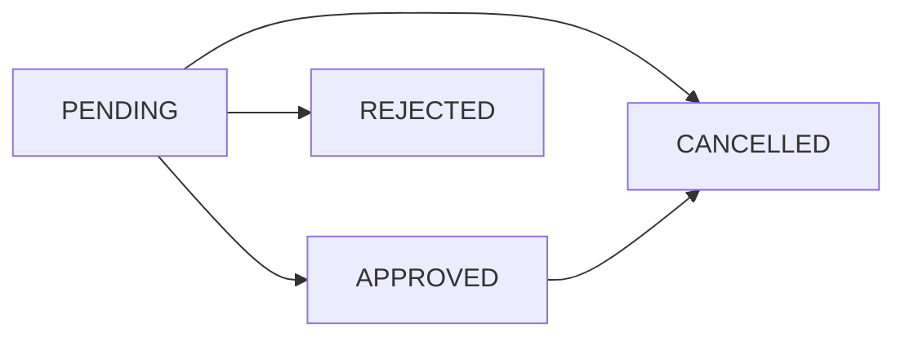

# Leave Application & Approval Workflow Documentation

## System Overview

The Leave Application & Approval Workflow provides a complete end-to-end solution for staff to apply for leave and administrators to manage approvals with automatic balance deduction and comprehensive validation.

## Core Features

### **Staff Flow**
1. **Leave Application**
   - Select leave type from school-configured options
   - Choose date range with calendar picker
   - Auto-calculate working days (excludes weekends & holidays)
   - Provide reason and optional remarks
   - Real-time validation for overlaps and balance sufficiency

2. **Overlap Prevention**
   - Automatic detection of conflicting leave dates
   - Real-time validation against existing applications
   - Clear error messages with specific conflicting dates

3. **Balance Validation**
   - Real-time balance checking before submission
   - Integration with leave balance engine
   - Prevents over-allocation of leave days

### **Admin Flow**
1. **Approval Dashboard**
   - Pending requests tab for quick action
   - All requests tab with filtering and search
   - Batch approval/rejection capabilities
   - Status-based filtering and search functionality

2. **Approval Actions**
   - Approve with optional remarks
   - Reject with mandatory reason
   - Bulk operations for multiple requests
   - Audit trail for all decisions

## Technical Implementation

### **Firestore Collections**

#### **Leave Applications**
```
/schools/{schoolId}/leaves/{leaveId}
```

**Document Structure:**
```json
{
  "schoolId": "school_abc123",
  "applicantId": "firebase_user_id",
  "staffId": "staff_profile_id",
  "leaveTypeId": "leave_type_id",
  "leaveTypeCode": "CASUAL",
  "academicYear": "2024-25",
  "startDate": "2024-12-25T00:00:00Z",
  "endDate": "2024-12-27T00:00:00Z",
  "leaveDates": [
    "2024-12-25T00:00:00Z",
    "2024-12-26T00:00:00Z",
    "2024-12-27T00:00:00Z"
  ],
  "totalDays": 3,
  "reason": "Family vacation during Christmas",
  "status": "PENDING",
  "createdAt": "2024-12-22T10:30:00Z",
  "updatedAt": "2024-12-22T10:30:00Z",
  "approvedBy": null,
  "approvedAt": null,
  "rejectionReason": null,
  "remarks": "Planning to visit family",
  "metadata": {
    "holidaysExcluded": 1,
    "weekendsExcluded": 0,
    "leaveTypeConfig": {
      "name": "Casual Leave",
      "maxDaysPerRequest": 5,
      "isPaid": true
    }
  }
}
```

#### **Holidays Configuration**
```
/schools/{schoolId}/holidays/{holidayId}
```

**Document Structure:**
```json
{
  "schoolId": "school_abc123",
  "date": "2024-12-25T00:00:00Z",
  "name": "Christmas Day",
  "description": "Christmas holiday",
  "isRecurring": true,
  "recurringType": "YEARLY",
  "isActive": true
}
```

### **Status Lifecycle**



**Status Transitions:**
- **PENDING → APPROVED**: Admin approves the request
- **PENDING → REJECTED**: Admin rejects with reason
- **PENDING → CANCELLED**: Staff cancels own request
- **APPROVED → CANCELLED**: Staff cancels approved future leave

### **Cloud Functions**

#### **1. Leave Status Change Processor**
```javascript
exports.processLeaveStatusChange = functions.firestore
  .document('/schools/{schoolId}/leaves/{leaveId}')
  .onUpdate(async (change, context) => {
    // Handles balance updates when status changes
    // PENDING → APPROVED: Move from pending to used
    // PENDING → REJECTED/CANCELLED: Release pending days
    // APPROVED → CANCELLED: Return used days (for future leaves)
  });
```

#### **2. Leave Application Validator**
```javascript
exports.validateLeaveApplication = functions.firestore
  .document('/schools/{schoolId}/leaves/{leaveId}')
  .onCreate(async (snap, context) => {
    // Server-side validation on creation
    // Validates dates, overlaps, balance sufficiency
    // Auto-rejects invalid applications
  });
```

#### **3. Bulk Approval Handler**
```javascript
exports.bulkProcessLeaveApplications = functions.https.onCall(async (data, context) => {
  // Batch approve/reject multiple applications
  // Atomic operations with rollback on failure
  // Returns detailed results for each application
});
```

## Validation Rules

### **Date Validation**
1. **Past Date Prevention**
   - Start date cannot be in the past
   - Grace period of same-day applications allowed

2. **Date Range Validation**
   - End date must be after start date
   - Maximum date range based on leave type configuration

3. **Academic Year Boundary**
   - All leave dates must fall within current academic year
   - Cross-year leave applications not allowed

### **Overlap Detection**
```javascript
// Algorithm for overlap detection
function hasOverlappingLeaves(newLeaveDates, existingApplications) {
  const existingDates = new Set();
  
  // Collect all existing leave dates (PENDING + APPROVED)
  for (const application of existingApplications) {
    if (application.status === 'PENDING' || application.status === 'APPROVED') {
      application.leaveDates.forEach(date => {
        existingDates.add(normalizeDate(date));
      });
    }
  }
  
  // Check for overlaps
  return newLeaveDates.some(date => 
    existingDates.has(normalizeDate(date))
  );
}
```

### **Balance Validation**
1. **Sufficient Balance Check**
   ```javascript
   if (requestedDays > availableBalance) {
     throw new Error(`Insufficient balance. Available: ${availableBalance}, Requested: ${requestedDays}`);
   }
   ```

2. **Leave Type Constraints**
   ```javascript
   if (requestedDays > leaveType.maxDaysPerRequest) {
     throw new Error(`Maximum ${leaveType.maxDaysPerRequest} days allowed per request`);
   }
   ```

### **Working Days Calculation**
```javascript
function calculateLeaveDates(startDate, endDate, holidays) {
  const leaveDates = [];
  const holidayDates = new Set(holidays.map(h => normalizeDate(h.date)));
  
  let currentDate = new Date(startDate);
  const end = new Date(endDate);
  
  while (currentDate <= end) {
    // Skip weekends (Saturday = 6, Sunday = 0)
    if (currentDate.getDay() !== 0 && currentDate.getDay() !== 6) {
      // Skip holidays
      if (!holidayDates.has(normalizeDate(currentDate))) {
        leaveDates.push(new Date(currentDate));
      }
    }
    currentDate.setDate(currentDate.getDate() + 1);
  }
  
  return leaveDates;
}
```

## UI Components

### **Staff Apply Leave Screen**
- **Leave Type Selection**: Dropdown with type details and constraints
- **Date Range Picker**: Calendar interface with validation
- **Working Days Calculator**: Real-time calculation display
- **Reason Input**: Required text field with validation
- **Remarks Input**: Optional additional information
- **Real-time Validation**: Immediate feedback on errors

### **Admin Approval Screen**
- **Tabbed Interface**: Pending vs All requests
- **Search & Filter**: By staff name, leave type, status
- **Request Cards**: Comprehensive leave details display
- **Approval Actions**: Approve/Reject with reason/remarks
- **Bulk Operations**: Multi-select for batch processing
- **Status History**: Complete audit trail display

## Edge Cases Handled

### **1. Concurrent Applications**
- **Problem**: Multiple staff submitting overlapping requests simultaneously
- **Solution**: Firestore transactions with atomic balance updates
- **Implementation**: Server-side validation with retry logic

### **2. Mid-Application Configuration Changes**
- **Problem**: Leave type configuration changes while application is pending
- **Solution**: Snapshot leave type config in application metadata
- **Implementation**: Immutable configuration reference per application

### **3. Retroactive Leave Cancellation**
- **Problem**: Staff cancels approved leave after it has occurred
- **Solution**: Allow cancellation only for future leave dates
- **Implementation**: Date-based validation in cancellation logic

### **4. Academic Year Transition**
- **Problem**: Leave applications spanning academic year boundary
- **Solution**: Restrict applications to current academic year only
- **Implementation**: Academic year validation in date picker

### **5. Insufficient Balance After Approval**
- **Problem**: Balance changes between application and approval
- **Solution**: Re-validate balance at approval time
- **Implementation**: Atomic balance check in approval Cloud Function

## Security Considerations

### **Multi-Tenant Isolation**
- All operations scoped to `schoolId`
- Cross-school access prevented by security rules
- Staff can only access own applications

### **Role-Based Access Control**
- **STAFF**: Can create and cancel own applications only
- **ADMIN**: Can approve/reject all school applications
- **SUPER_ADMIN**: Can access all schools' applications

### **Data Integrity**
- Immutable core fields (dates, applicant, leave type)
- Audit trail for all status changes
- Server-side validation for all operations

## Performance Optimizations

### **Firestore Indexes**
```javascript
// Leave applications by school and status
{
  "collectionGroup": "leaves",
  "fields": [
    {"fieldPath": "schoolId", "order": "ASCENDING"},
    {"fieldPath": "status", "order": "ASCENDING"},
    {"fieldPath": "createdAt", "order": "DESCENDING"}
  ]
}

// Leave applications by applicant
{
  "collectionGroup": "leaves", 
  "fields": [
    {"fieldPath": "schoolId", "order": "ASCENDING"},
    {"fieldPath": "applicantId", "order": "ASCENDING"},
    {"fieldPath": "createdAt", "order": "DESCENDING"}
  ]
}

// Holidays by school and date range
{
  "collectionGroup": "holidays",
  "fields": [
    {"fieldPath": "schoolId", "order": "ASCENDING"},
    {"fieldPath": "isActive", "order": "ASCENDING"},
    {"fieldPath": "date", "order": "ASCENDING"}
  ]
}
```

### **Caching Strategy**
- **Leave Types**: Cached at school level
- **Holidays**: Cached per academic year
- **Balance Data**: Real-time queries with optimistic updates

## Testing Scenarios

### **Functional Testing**
1. **Happy Path**: Complete leave application and approval flow
2. **Overlap Detection**: Submit overlapping leave requests
3. **Balance Validation**: Apply for leave exceeding available balance
4. **Date Validation**: Apply for past dates or invalid ranges
5. **Approval Workflow**: Test all status transitions
6. **Bulk Operations**: Batch approve/reject multiple requests

### **Security Testing**
1. **Cross-Tenant Access**: Attempt to access other schools' data
2. **Role Validation**: Test permissions for each user role
3. **Data Tampering**: Attempt to modify immutable fields
4. **Balance Manipulation**: Try to bypass balance validation

### **Performance Testing**
1. **Concurrent Applications**: Multiple simultaneous submissions
2. **Large Date Ranges**: Applications with many leave days
3. **Bulk Operations**: Process large batches of applications
4. **Query Performance**: Test with large datasets

## Deployment Checklist

### **Firestore Setup**
- [ ] Deploy security rules for leave collections
- [ ] Create composite indexes for query optimization
- [ ] Set up holiday data for schools
- [ ] Configure leave type defaults

### **Cloud Functions**
- [ ] Deploy leave approval workflow functions
- [ ] Test function triggers and error handling
- [ ] Configure function timeouts and memory limits
- [ ] Set up monitoring and alerting

### **Flutter App**
- [ ] Test leave application flow end-to-end
- [ ] Validate UI responsiveness and error handling
- [ ] Test offline behavior and sync
- [ ] Verify navigation and state management

This comprehensive leave application and approval workflow ensures a smooth, validated, and secure process for managing staff leave requests while maintaining data integrity and providing excellent user experience for both staff and administrators.
