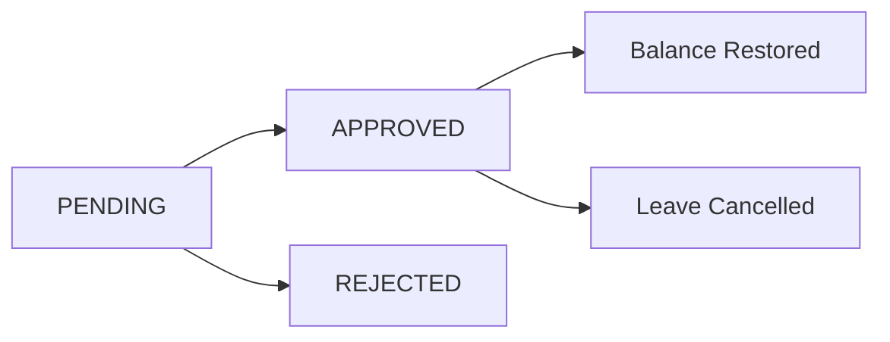
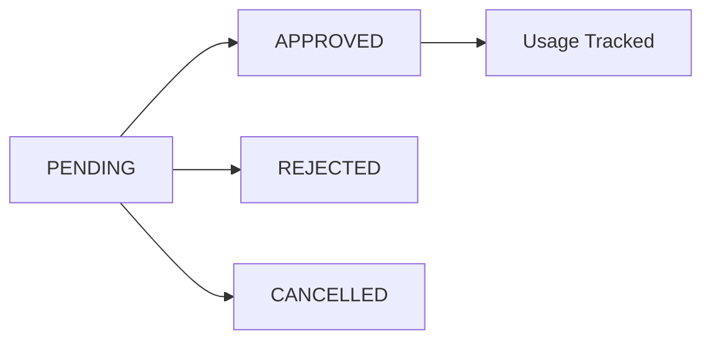

# Leave Cancellation and Permission Management System Documentation

## System Overview

The Leave Cancellation and Permission Management System provides comprehensive functionality for staff to cancel approved leaves and request permissions, with proper admin approval workflows and automatic balance restoration.

## Core Features

### **Leave Cancellation System**

#### **Pending Leave Cancellation**
- **Direct Cancellation**: Staff can cancel pending leaves immediately without admin approval
- **Automatic Balance Restoration**: Pending days are released back to available balance
- **Real-time Updates**: Balance updates happen instantly via Cloud Function triggers

#### **Approved Leave Cancellation**
- **Request-Based Process**: Staff must request cancellation for approved leaves
- **Admin Approval Required**: All approved leave cancellations need admin approval
- **Future Leave Only**: Cannot cancel leaves that have already started or passed
- **Balance Restoration**: Days are restored to balance only after admin approval

### **Permission Management System**

#### **School-Level Configuration**
- **Monthly Limits**: Configurable number of permissions per month per staff
- **Duration Limits**: Maximum duration per permission request
- **Approval Requirements**: Toggle for requiring admin approval
- **Custom Rules**: Extensible configuration for school-specific policies

#### **Monthly Usage Tracking**
- **Real-time Counters**: Track total requests, approved requests, and time used
- **Automatic Reset**: Monthly counters reset automatically
- **Usage Analytics**: Comprehensive reporting for admin dashboard

## Technical Implementation

### **Firestore Collections**

#### **Leave Cancellation Requests**
```
/schools/{schoolId}/leaveCancellations/{cancellationId}
```

**Document Structure:**
```json
{
  "schoolId": "school_abc123",
  "leaveApplicationId": "leave_xyz789",
  "applicantId": "firebase_user_id",
  "staffId": "staff_profile_id",
  "leaveTypeId": "leave_type_id",
  "leaveTypeCode": "CASUAL",
  "academicYear": "2024-25",
  "totalDaysToRestore": 3,
  "cancellationReason": "Family emergency resolved",
  "status": "PENDING",
  "requestedAt": "2024-12-22T14:30:00Z",
  "updatedAt": "2024-12-22T14:30:00Z",
  "approvedBy": null,
  "approvedAt": null,
  "rejectionReason": null,
  "adminRemarks": null,
  "metadata": {
    "originalLeaveStartDate": "2024-12-25T00:00:00Z",
    "originalLeaveEndDate": "2024-12-27T00:00:00Z",
    "originalLeaveDates": ["2024-12-25T00:00:00Z", "2024-12-26T00:00:00Z", "2024-12-27T00:00:00Z"],
    "leaveApplicationCreatedAt": "2024-12-20T10:00:00Z"
  }
}
```

#### **Permission Requests**
```
/schools/{schoolId}/permissions/{permissionId}
```

**Document Structure:**
```json
{
  "schoolId": "school_abc123",
  "applicantId": "firebase_user_id",
  "staffId": "staff_profile_id",
  "requestDate": "2024-12-23T00:00:00Z",
  "startTime": "2024-12-23T10:00:00Z",
  "endTime": "2024-12-23T12:00:00Z",
  "durationMinutes": 120,
  "reason": "Medical appointment",
  "status": "PENDING",
  "createdAt": "2024-12-22T15:00:00Z",
  "updatedAt": "2024-12-22T15:00:00Z",
  "approvedBy": null,
  "approvedAt": null,
  "rejectionReason": null,
  "remarks": "Doctor's appointment for routine checkup",
  "metadata": {
    "permissionConfig": {
      "monthlyLimit": 10,
      "maxDurationMinutes": 240,
      "requiresApproval": true
    },
    "currentMonthUsage": 3,
    "calculatedDuration": 120
  }
}
```

#### **Permission Configuration**
```
/schools/{schoolId}/permissionConfig/default
```

**Document Structure:**
```json
{
  "schoolId": "school_abc123",
  "monthlyLimit": 10,
  "maxDurationMinutes": 240,
  "requiresApproval": true,
  "isActive": true,
  "createdAt": "2024-09-01T00:00:00Z",
  "updatedAt": "2024-12-01T00:00:00Z",
  "createdBy": "admin_user_id",
  "customRules": {
    "allowWeekends": false,
    "allowHolidays": false,
    "minAdvanceNoticeHours": 2
  }
}
```

#### **Monthly Permission Usage**
```
/schools/{schoolId}/monthlyPermissionUsage/{staffId}_{month}
```

**Document Structure:**
```json
{
  "schoolId": "school_abc123",
  "staffId": "staff_profile_id",
  "userId": "firebase_user_id",
  "month": "2024-12",
  "totalRequests": 5,
  "approvedRequests": 4,
  "totalMinutesUsed": 480,
  "createdAt": "2024-12-01T00:00:00Z",
  "updatedAt": "2024-12-22T15:00:00Z",
  "metadata": {
    "lastRequestDate": "2024-12-22T00:00:00Z",
    "averageDurationMinutes": 120
  }
}
```

## Cloud Functions Implementation

### **Leave Cancellation Workflow**

#### **1. Leave Cancellation Request Processor**
```javascript
exports.processLeaveCancellationRequest = functions.firestore
  .document('/schools/{schoolId}/leaveCancellations/{cancellationId}')
  .onCreate(async (snap, context) => {
    // Validates leave application exists and is cancellable
    // Checks if leave is in the future
    // Prevents duplicate cancellation requests
    // Auto-rejects invalid requests with detailed reasons
  });
```

#### **2. Leave Cancellation Approval Handler**
```javascript
exports.processLeaveCancellationApproval = functions.firestore
  .document('/schools/{schoolId}/leaveCancellations/{cancellationId}')
  .onUpdate(async (change, context) => {
    // Processes approved cancellation requests
    // Restores leave balance atomically
    // Updates original leave application status
    // Creates balance mutation audit record
  });
```

### **Permission Management Workflow**

#### **3. Permission Request Validator**
```javascript
exports.validatePermissionRequest = functions.firestore
  .document('/schools/{schoolId}/permissions/{permissionId}')
  .onCreate(async (snap, context) => {
    // Validates permission timing and duration
    // Checks monthly limits
    // Initializes usage tracking
    // Auto-rejects invalid requests
  });
```

#### **4. Permission Status Change Handler**
```javascript
exports.processPermissionStatusChange = functions.firestore
  .document('/schools/{schoolId}/permissions/{permissionId}')
  .onUpdate(async (change, context) => {
    // Updates monthly usage counters
    // Handles approval/rejection status changes
    // Maintains accurate usage statistics
  });
```

## Status Lifecycles

### **Leave Cancellation Status Flow**


### **Permission Request Status Flow**


## Validation Rules

### **Leave Cancellation Validation**

#### **Approved Leave Cancellation**
```javascript
// Future leave validation
if (leaveStartDate < today) {
  throw new Error('Cannot cancel leave that has already started or passed');
}

// Ownership validation
if (leaveData.applicantId !== cancellationData.applicantId) {
  throw new Error('Only the leave applicant can request cancellation');
}

// Duplicate request prevention
const existingCancellation = await checkExistingCancellationRequest(leaveId);
if (existingCancellation) {
  throw new Error('A cancellation request is already pending for this leave');
}
```

#### **Pending Leave Cancellation**
```javascript
// Direct cancellation for pending leaves
if (leaveApplication.status === 'PENDING') {
  // Can be cancelled immediately without admin approval
  await updateLeaveStatus(leaveId, 'CANCELLED');
  // Balance restoration handled by existing Cloud Function
}
```

### **Permission Request Validation**

#### **Timing Validation**
```javascript
function validatePermissionTiming(requestDate, startTime, endTime, config) {
  // Past date prevention
  if (requestDate < today) {
    return 'Permission date cannot be in the past';
  }
  
  // Duration validation
  const durationMinutes = calculateDuration(startTime, endTime);
  if (durationMinutes > config.maxDurationMinutes) {
    return `Duration exceeds maximum allowed (${config.maxDurationDisplayText})`;
  }
  
  // Same day validation
  if (!isSameDate(requestDate, startTime, endTime)) {
    return 'Start and end times must be on the same date as permission date';
  }
  
  return null; // Valid
}
```

#### **Monthly Limit Validation**
```javascript
function validateMonthlyLimits(currentUsage, config) {
  if (currentUsage.totalRequests >= config.monthlyLimit) {
    throw new Error(
      `Monthly limit exceeded (${config.monthlyLimit} permissions per month)`
    );
  }
}
```

## Balance & Count Consistency Rules

### **Leave Balance Restoration**

#### **Atomic Balance Updates**
```javascript
await db.runTransaction(async (transaction) => {
  const balanceDoc = await transaction.get(balanceRef);
  const currentBalance = balanceDoc.data();
  
  // Calculate new balance values
  const newUsed = Math.max(0, currentBalance.used - totalDaysToRestore);
  const newAvailable = currentBalance.available + totalDaysToRestore;
  
  // Update balance atomically
  transaction.update(balanceRef, {
    used: newUsed,
    available: newAvailable,
    updatedAt: admin.firestore.FieldValue.serverTimestamp()
  });
  
  // Create audit trail
  transaction.set(mutationRef, mutationData);
});
```

#### **Balance Consistency Checks**
- **Never Negative**: `available >= 0` enforced at all times
- **Total Consistency**: `totalAllowed + carriedForward = used + pending + available`
- **Audit Trail**: Every balance change tracked with mutation records

### **Permission Usage Tracking**

#### **Monthly Counter Updates**
```javascript
function updateMonthlyUsage(permissionData, previousStatus, newStatus) {
  let updates = {};
  
  if (previousStatus === 'PENDING' && newStatus === 'APPROVED') {
    updates.approvedRequests = admin.firestore.FieldValue.increment(1);
    updates.totalMinutesUsed = admin.firestore.FieldValue.increment(durationMinutes);
  } else if (previousStatus === 'APPROVED' && newStatus === 'CANCELLED') {
    updates.approvedRequests = admin.firestore.FieldValue.increment(-1);
    updates.totalMinutesUsed = admin.firestore.FieldValue.increment(-durationMinutes);
  }
  
  return updates;
}
```

#### **Usage Consistency Rules**
- **Non-negative Counters**: All usage counters must be >= 0
- **Accurate Totals**: `approvedRequests <= totalRequests`
- **Time Tracking**: `totalMinutesUsed` reflects only approved permissions

## UI Implementation

### **Staff Leave Cancellation Flow**

#### **Cancellable Leaves Display**
- **Pending Leaves**: Show "Cancel" button for immediate cancellation
- **Approved Future Leaves**: Show "Request Cancellation" button
- **Past/Current Leaves**: No cancellation option available
- **Status Indicators**: Clear visual status for each leave

#### **Cancellation Request Form**
- **Reason Input**: Required field for cancellation reason
- **Confirmation Dialog**: Clear explanation of the cancellation process
- **Status Tracking**: Real-time updates on cancellation request status

### **Staff Permission Request Flow**

#### **Permission Policy Display**
- **Monthly Limit**: Show current usage vs. limit with progress bar
- **Duration Limit**: Display maximum allowed duration
- **Usage Statistics**: Show approved requests and total time used

#### **Permission Request Form**
- **Date Picker**: Future dates only with validation
- **Time Pickers**: Start and end time with duration calculation
- **Real-time Validation**: Immediate feedback on policy violations
- **Monthly Usage**: Live display of current month's usage

### **Admin Approval Interfaces**

#### **Leave Cancellation Approval**
- **Pending Queue**: Prioritized list of cancellation requests
- **Request Details**: Complete leave and cancellation information
- **Approval Actions**: Approve with optional remarks or reject with reason
- **Batch Operations**: Process multiple requests efficiently

#### **Permission Request Approval**
- **Request Dashboard**: Tabbed interface for pending vs. all requests
- **Staff Information**: Context about requester and usage history
- **Quick Actions**: One-click approve/reject with reason capture
- **Usage Analytics**: Monthly statistics and trends

## Security Considerations

### **Multi-Tenant Isolation**
- **School-Scoped Operations**: All operations limited to user's school
- **Cross-School Prevention**: Security rules prevent data access across schools
- **Role-Based Access**: Staff can only manage own requests, admins manage school requests

### **Data Integrity Protection**
- **Immutable Audit Trail**: Cancellation and permission records cannot be modified
- **Atomic Operations**: Balance updates and status changes are atomic
- **Validation Layers**: Client, server, and database-level validation

### **Permission Validation**
- **Ownership Checks**: Users can only cancel own leaves and permissions
- **Status Validation**: Proper status transition enforcement
- **Time-Based Rules**: Future-only cancellations and permissions

## Performance Optimizations

### **Firestore Indexes**
```javascript
// Leave cancellation requests by school and status
{
  "collectionGroup": "leaveCancellations",
  "fields": [
    {"fieldPath": "schoolId", "order": "ASCENDING"},
    {"fieldPath": "status", "order": "ASCENDING"},
    {"fieldPath": "requestedAt", "order": "DESCENDING"}
  ]
}

// Permission requests by school and status
{
  "collectionGroup": "permissions",
  "fields": [
    {"fieldPath": "schoolId", "order": "ASCENDING"},
    {"fieldPath": "status", "order": "ASCENDING"},
    {"fieldPath": "createdAt", "order": "DESCENDING"}
  ]
}

// Monthly permission usage by school and month
{
  "collectionGroup": "monthlyPermissionUsage",
  "fields": [
    {"fieldPath": "schoolId", "order": "ASCENDING"},
    {"fieldPath": "month", "order": "DESCENDING"}
  ]
}
```

### **Caching Strategy**
- **Permission Config**: Cached at school level with TTL
- **Monthly Usage**: Real-time queries with optimistic updates
- **Leave Data**: Cached with invalidation on status changes

## Error Handling & Recovery

### **Validation Failures**
- **Client-Side**: Immediate feedback with clear error messages
- **Server-Side**: Detailed validation with specific error codes
- **Auto-Rejection**: Invalid requests automatically rejected with reasons

### **System Failures**
- **Transaction Rollback**: Atomic operations with automatic rollback
- **Retry Logic**: Automatic retry for transient failures
- **Alert System**: Admin notifications for processing failures

### **Data Consistency**
- **Balance Verification**: Regular consistency checks for leave balances
- **Usage Audits**: Monthly permission usage validation
- **Reconciliation**: Automated data reconciliation processes

## Testing Scenarios

### **Leave Cancellation Testing**
1. **Pending Leave Cancellation**: Direct cancellation with balance restoration
2. **Approved Leave Cancellation**: Request-approval workflow
3. **Past Leave Cancellation**: Validation error handling
4. **Duplicate Requests**: Prevention of multiple cancellation requests
5. **Balance Consistency**: Verify correct balance restoration

### **Permission Management Testing**
1. **Monthly Limit Enforcement**: Reject requests exceeding limits
2. **Duration Validation**: Enforce maximum duration limits
3. **Usage Tracking**: Verify accurate counter updates
4. **Status Transitions**: Test all permission status changes
5. **Analytics Accuracy**: Validate usage statistics

### **Edge Case Testing**
1. **Concurrent Operations**: Multiple simultaneous requests
2. **Configuration Changes**: Mid-month policy updates
3. **Academic Year Transitions**: Cross-year request handling
4. **System Failures**: Recovery from partial failures
5. **Data Migration**: Handling of legacy data

This comprehensive Leave Cancellation and Permission Management System ensures proper workflow management, data consistency, and user experience while maintaining security and performance at scale.
