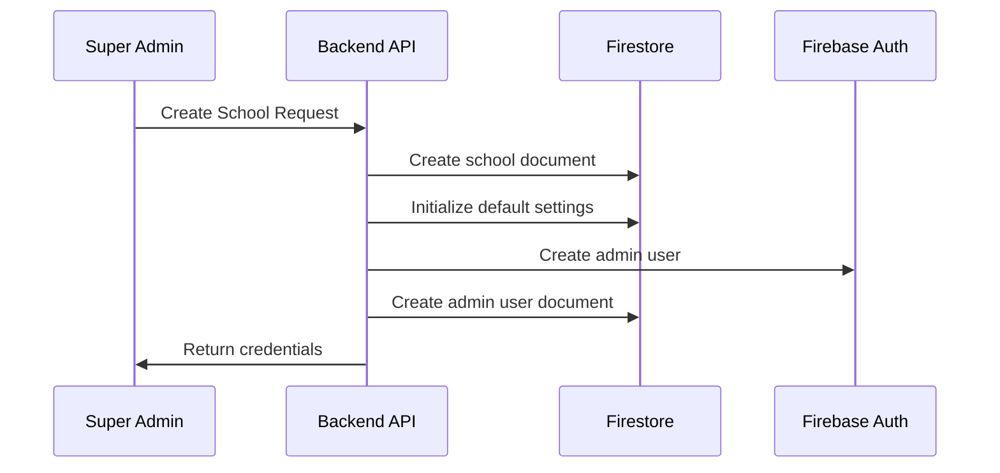
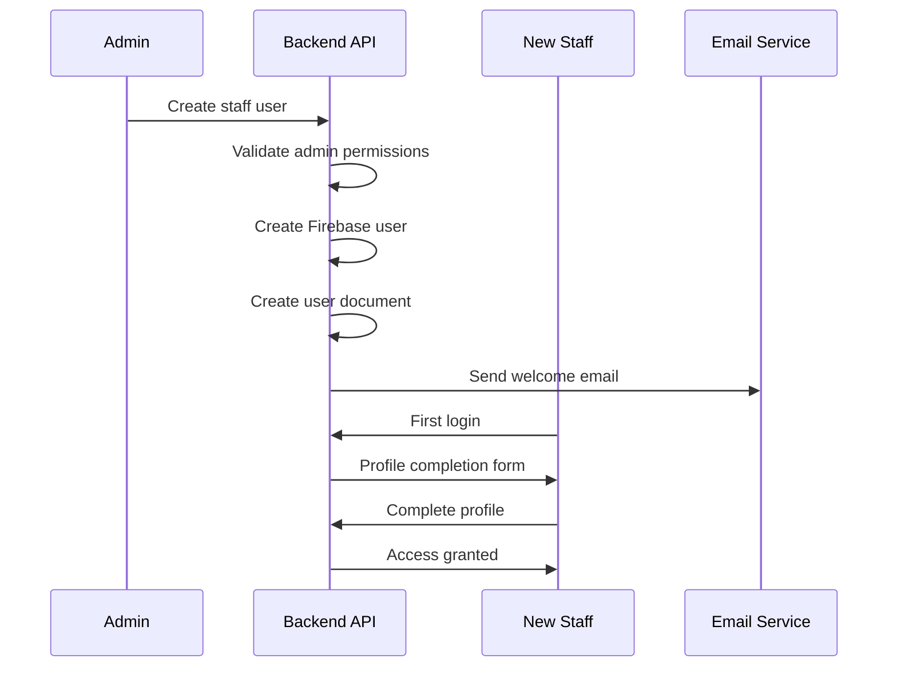

# Multi-Tenant School Staff Leave & Permission System Architecture

## 🏗️ Architecture Overview

This document provides a comprehensive overview of the multi-tenant SaaS platform architecture for a school staff leave and permission management system.

### Key Principles
- **Tenant Isolation**: Complete data separation between schools
- **Role-Based Access Control**: Hierarchical permissions (SUPER_ADMIN > ADMIN > STAFF)
- **Immutable School Assignment**: Users cannot change their schoolId after creation
- **Audit Trail**: Complete tracking of all operations
- **Scalable Design**: Supports multiple schools with varying sizes

## 📊 Firestore Schema

### Collection Structure
```
/schools/{schoolId}
/users/{uid}
/schools/{schoolId}/staff/{staffId}
/schools/{schoolId}/leaveTypes/{leaveTypeId}
/schools/{schoolId}/leaves/{leaveId}
/schools/{schoolId}/permissions/{permissionId}
/auditLogs/{logId}
```

### Core Entities

#### School Document
```typescript
interface School {
  schoolId: string;           // Primary identifier
  schoolName: string;         // Display name
  academicYearStart: Date;    // June 1st typically
  status: 'ACTIVE' | 'DISABLED';
  createdAt: Date;
  updatedAt: Date;
  createdBy: string;          // SUPER_ADMIN uid
  adminUserId?: string;       // Primary admin
  settings: SchoolSettings;
  subscription: SchoolSubscription;
}
```

#### User Document
```typescript
interface User {
  uid: string;                // Firebase Auth UID
  email: string;
  displayName: string;
  role: 'SUPER_ADMIN' | 'ADMIN' | 'STAFF';
  schoolId?: string;          // Immutable after creation
  staffType?: 'TEACHING' | 'NON_TEACHING';
  status: 'ACTIVE' | 'DISABLED';
  onboardingStatus: OnboardingStatus;
  createdAt: Date;
  updatedAt: Date;
  lastLoginAt?: Date;
  createdBy?: string;
  profile: UserProfile;
  permissions: UserPermissions;
}
```

## 🔐 Security & Access Control

### Role Hierarchy
```
SUPER_ADMIN (Platform Level)
    ↓ Can create schools and assign admins
ADMIN (School Level)
    ↓ Can manage staff and approve requests
STAFF (School Level)
    ↓ Can apply for leaves and permissions
```

### Firestore Security Rules
- **Tenant Isolation**: Users can only access their school's data
- **Role-Based Permissions**: Each role has specific read/write permissions
- **Immutable Fields**: Critical fields like schoolId cannot be modified
- **Audit Protection**: Audit logs are read-only and SUPER_ADMIN accessible only

### Key Security Functions
```javascript
// Tenant isolation check
function canAccessSchool(schoolId) {
  return isSuperAdmin() || (isUserActive() && belongsToSchool(schoolId));
}

// Role-based access control
function hasPermission(user, resource, action) {
  return checkRolePermissions(user.role, resource, action) &&
         validateTenantAccess(user.schoolId, resource.schoolId);
}
```

## 🚀 Operational Flows

### 1. Tenant Creation Flow


**Key Steps:**
1. SUPER_ADMIN creates school with basic info
2. System generates unique schoolId
3. Default leave types and settings created
4. Admin user account created with temporary password
5. Welcome email sent to admin

### 2. User Onboarding Flow


**Key Steps:**
1. ADMIN creates staff user with basic details
2. System generates temporary password
3. Staff receives welcome email
4. First login triggers profile completion
5. Staff updates profile and password
6. Full access granted

## 📋 Permission Matrix

| Resource/Action | SUPER_ADMIN | ADMIN | STAFF |
|----------------|-------------|-------|-------|
| Create School | ✅ | ❌ | ❌ |
| Manage School Settings | ✅ | ✅* | ❌ |
| Create Staff Users | ❌ | ✅* | ❌ |
| Apply for Leave | ❌ | ✅* | ✅* |
| Approve Leaves | ✅ | ✅* | ❌ |
| View Reports | ✅ | ✅* | ❌ |
| Manage Subscriptions | ✅ | ❌ | ❌ |

*\* = Limited to own school*

## 🛠️ Implementation Details

### Domain Entities

#### School Entity
```dart
class School {
  final String schoolId;
  final String schoolName;
  final DateTime academicYearStart;
  final SchoolStatus status;
  final SchoolSettings settings;
  final SchoolSubscription subscription;
  // ... other fields
}
```

#### AppUser Entity
```dart
class AppUser {
  final String uid;
  final String email;
  final UserRole role;
  final String? schoolId; // Immutable
  final StaffType? staffType;
  final UserStatus status;
  final UserProfile profile;
  final UserPermissions permissions;
  // ... other fields
}
```

### Repository Pattern
```dart
abstract class SchoolRepository {
  Future<School> createSchool(CreateSchoolRequest request);
  Future<List<School>> getAllSchools(); // SUPER_ADMIN only
  Future<School?> getSchool(String schoolId);
  Future<void> updateSchool(String schoolId, UpdateSchoolRequest request);
}

abstract class UserRepository {
  Future<AppUser> createUser(CreateUserRequest request);
  Future<List<AppUser>> getSchoolUsers(String schoolId);
  Future<AppUser?> getUser(String uid);
  Future<void> updateUser(String uid, UpdateUserRequest request);
}
```

## 🔄 Data Flow Architecture

### Authentication Flow
1. User logs in via Firebase Auth
2. System fetches user document from Firestore
3. Role and school validation performed
4. Appropriate dashboard loaded based on role

### Authorization Flow
1. Every request includes user token
2. Backend validates token and extracts user info
3. Permission check performed against resource
4. Tenant isolation validated
5. Operation allowed/denied

### Audit Flow
1. All operations logged to audit collection
2. Logs include user, action, resource, timestamp
3. Immutable audit trail maintained
4. SUPER_ADMIN can access all logs

## 📈 Scalability Considerations

### Database Design
- **Subcollections**: School-specific data in subcollections for better performance
- **Indexing**: Proper indexes on schoolId, role, status fields
- **Pagination**: Large datasets paginated for performance

### Security Rules Optimization
- **Minimal Reads**: Security rules optimized to minimize Firestore reads
- **Caching**: User data cached to avoid repeated lookups
- **Efficient Queries**: Rules support compound queries with proper indexing

### Performance Optimization
- **Connection Pooling**: Efficient Firebase connection management
- **Batch Operations**: Multiple operations batched when possible
- **Real-time Updates**: Firestore listeners for real-time data sync

## 🚨 Error Handling & Recovery

### Tenant Creation Rollback
```javascript
try {
  // Create school, admin user, initialize data
} catch (error) {
  // Rollback in reverse order
  if (adminUser) await deleteUser(adminUser.uid);
  if (schoolDoc) await deleteSchool(schoolId);
  throw error;
}
```

### Data Consistency
- **Transactions**: Critical operations wrapped in Firestore transactions
- **Validation**: Comprehensive data validation at API level
- **Constraints**: Database constraints enforced via security rules

## 📊 Monitoring & Analytics

### Key Metrics
- **Tenant Growth**: Number of schools created over time
- **User Activity**: Login frequency, feature usage
- **System Performance**: Response times, error rates
- **Security Events**: Failed access attempts, permission violations

### Audit Capabilities
- **Complete Audit Trail**: All operations logged with context
- **Compliance Reporting**: Generate compliance reports for schools
- **Security Monitoring**: Track suspicious activities across tenants

## 🔮 Future Enhancements

### Planned Features
1. **Multi-Region Support**: Deploy across multiple regions
2. **Advanced Analytics**: ML-powered insights and predictions
3. **Mobile Apps**: Native iOS/Android applications
4. **API Gateway**: Rate limiting and advanced security
5. **Backup & Recovery**: Automated backup and disaster recovery

### Scalability Roadmap
1. **Microservices**: Break down into smaller services
2. **Event-Driven Architecture**: Implement event sourcing
3. **Caching Layer**: Add Redis for improved performance
4. **CDN Integration**: Global content delivery network

## 📚 Documentation References

- [Firestore Schema](./firestore-schema.md)
- [Tenant Creation Flow](./tenant-creation-flow.md)
- [User Onboarding Flow](./user-onboarding-flow.md)
- [RBAC Matrix](./rbac-matrix.md)
- [Security Rules](./firestore-security-rules.md)

---

**Architecture Status**: ✅ Complete Foundation Ready
**Next Steps**: Implement repository layer and API endpoints
**Last Updated**: December 2024
