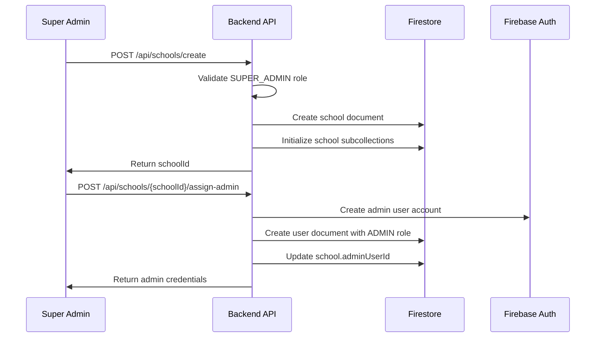

# Tenant Creation Flow

## SUPER_ADMIN School Creation Process

### 1. Prerequisites
- User must have `role: "SUPER_ADMIN"`
- User must have `permissions.canCreateSchools: true`
- Valid subscription plan selected

### 2. School Creation Steps



### 3. API Endpoints

#### Create School
```typescript
POST /api/schools/create
Authorization: Bearer <super_admin_token>

Request Body:
{
  "schoolName": "Green Valley High School",
  "adminEmail": "admin@greenvalley.edu",
  "adminName": "John Smith",
  "academicYearStart": "2024-06-01",
  "settings": {
    "timezone": "Asia/Kolkata",
    "currency": "INR",
    "workingDays": ["MONDAY", "TUESDAY", "WEDNESDAY", "THURSDAY", "FRIDAY"]
  },
  "subscription": {
    "plan": "PREMIUM",
    "maxStaff": 100
  }
}

Response:
{
  "success": true,
  "schoolId": "school_001",
  "adminUserId": "admin_uid_001",
  "temporaryPassword": "TempPass123!",
  "message": "School created successfully"
}
```

### 4. Firestore Operations

#### Step 1: Create School Document
```javascript
const schoolData = {
  schoolId: generateSchoolId(),
  schoolName: request.schoolName,
  academicYearStart: new Date(request.academicYearStart),
  status: "ACTIVE",
  createdAt: FieldValue.serverTimestamp(),
  updatedAt: FieldValue.serverTimestamp(),
  createdBy: superAdminUid,
  settings: request.settings,
  subscription: {
    ...request.subscription,
    isActive: true,
    expiresAt: calculateExpiryDate(request.subscription.plan)
  }
};

await db.collection('schools').doc(schoolId).set(schoolData);
```

#### Step 2: Initialize School Subcollections
```javascript
// Create default leave types
const defaultLeaveTypes = [
  {
    leaveTypeId: "casual_leave",
    name: "Casual Leave",
    maxDaysPerYear: 12,
    carryForward: false,
    isActive: true
  },
  {
    leaveTypeId: "sick_leave", 
    name: "Sick Leave",
    maxDaysPerYear: 12,
    carryForward: false,
    isActive: true
  },
  {
    leaveTypeId: "earned_leave",
    name: "Earned Leave", 
    maxDaysPerYear: 15,
    carryForward: true,
    isActive: true
  }
];

const batch = db.batch();
defaultLeaveTypes.forEach(leaveType => {
  const ref = db.collection('schools').doc(schoolId)
    .collection('leaveTypes').doc(leaveType.leaveTypeId);
  batch.set(ref, {
    ...leaveType,
    createdAt: FieldValue.serverTimestamp(),
    createdBy: superAdminUid
  });
});
await batch.commit();
```

#### Step 3: Create Admin User
```javascript
// Create Firebase Auth user
const adminUser = await admin.auth().createUser({
  email: request.adminEmail,
  password: generateTemporaryPassword(),
  displayName: request.adminName,
  emailVerified: false
});

// Create user document
const userData = {
  uid: adminUser.uid,
  email: request.adminEmail,
  displayName: request.adminName,
  role: "ADMIN",
  schoolId: schoolId,
  staffType: "TEACHING", // Default, can be changed
  status: "ACTIVE",
  createdAt: FieldValue.serverTimestamp(),
  updatedAt: FieldValue.serverTimestamp(),
  permissions: {
    canManageStaff: true,
    canApproveLeaves: true,
    canViewReports: true,
    canManageSettings: true
  }
};

await db.collection('users').doc(adminUser.uid).set(userData);

// Update school with admin reference
await db.collection('schools').doc(schoolId).update({
  adminUserId: adminUser.uid,
  updatedAt: FieldValue.serverTimestamp()
});
```

### 5. Validation Rules

#### SUPER_ADMIN Validation
```javascript
function validateSuperAdmin(user) {
  return user.role === 'SUPER_ADMIN' && 
         user.status === 'ACTIVE' &&
         user.permissions?.canCreateSchools === true;
}
```

#### School Data Validation
```javascript
function validateSchoolData(data) {
  const required = ['schoolName', 'adminEmail', 'adminName', 'academicYearStart'];
  const missing = required.filter(field => !data[field]);
  
  if (missing.length > 0) {
    throw new Error(`Missing required fields: ${missing.join(', ')}`);
  }
  
  if (!isValidEmail(data.adminEmail)) {
    throw new Error('Invalid admin email format');
  }
  
  if (new Date(data.academicYearStart) < new Date()) {
    throw new Error('Academic year start date cannot be in the past');
  }
  
  return true;
}
```

### 6. Error Handling

```javascript
try {
  // School creation logic
} catch (error) {
  // Rollback operations
  if (schoolId) {
    await db.collection('schools').doc(schoolId).delete();
  }
  if (adminUser?.uid) {
    await admin.auth().deleteUser(adminUser.uid);
  }
  
  throw new Error(`School creation failed: ${error.message}`);
}
```

### 7. Post-Creation Actions

1. **Send Welcome Email** to admin with temporary credentials
2. **Create Audit Log** entry for school creation
3. **Initialize Default Settings** for the school
4. **Set up Billing** if applicable
5. **Send Notification** to SUPER_ADMIN about successful creation
