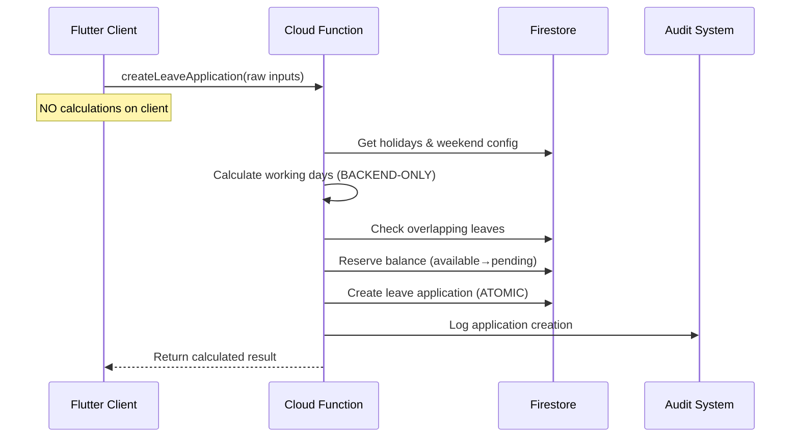
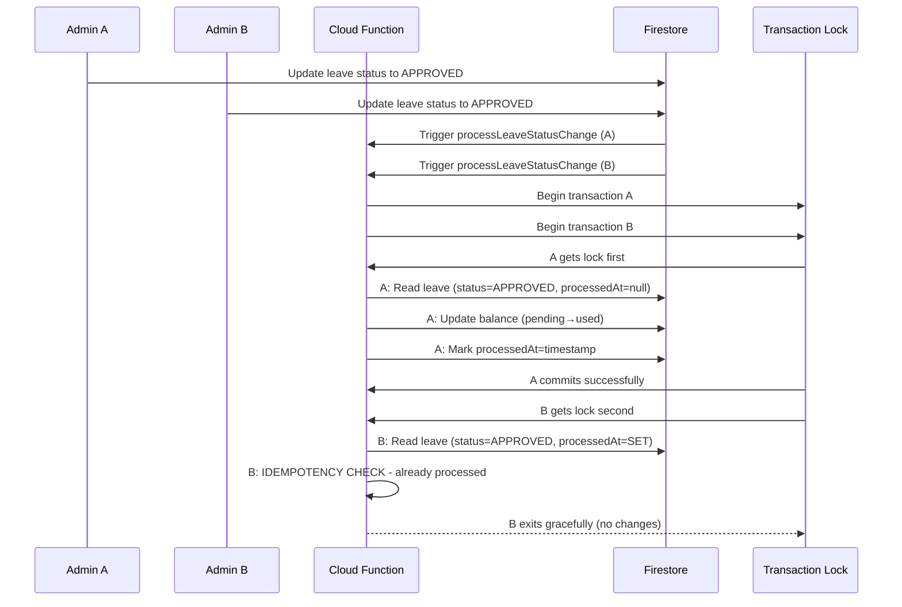
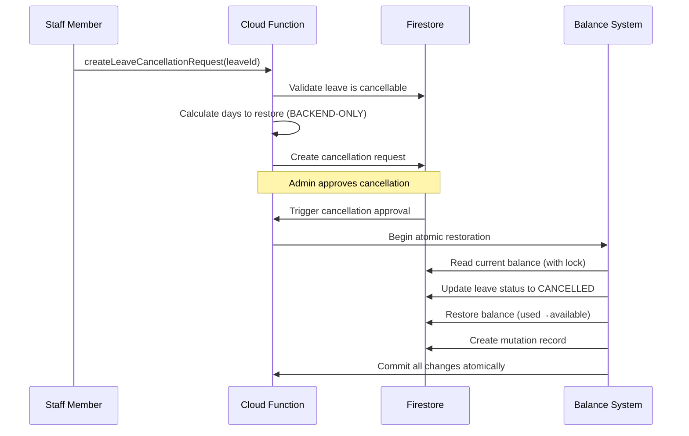
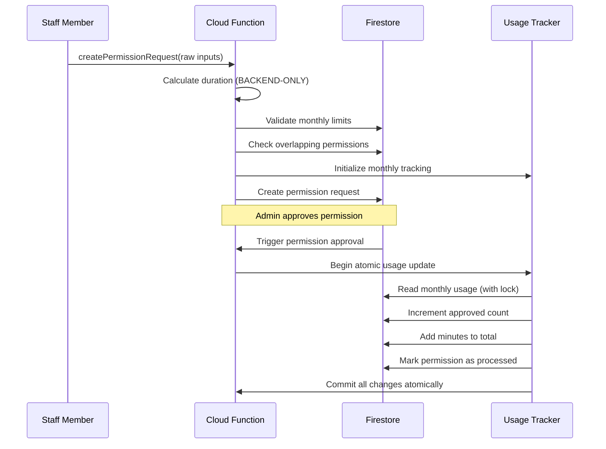

# UPDATED DATA FLOW ARCHITECTURE
## Multi-Tenant School Staff Leave & Permission Management System

## 🔄 **ATOMIC DATA FLOW PATTERNS**

### **1. LEAVE APPLICATION FLOW (BACKEND-ONLY)**



#### **ATOMIC BALANCE RESERVATION**
```javascript
// STEP 1: Reserve balance when application created
await db.runTransaction(async (transaction) => {
  const balanceDoc = await transaction.get(balanceRef);
  const currentBalance = balanceDoc.data();
  
  // Check availability
  if (currentBalance.available < totalDays) {
    throw new Error('Insufficient balance');
  }
  
  // Move from available to pending (atomic)
  transaction.update(balanceRef, {
    available: currentBalance.available - totalDays,
    pending: currentBalance.pending + totalDays
  });
});
```

### **2. LEAVE APPROVAL FLOW (RACE-CONDITION SAFE)**



#### **ATOMIC APPROVAL PROCESSING**
```javascript
// STEP 2: Process approval with race condition protection
await db.runTransaction(async (transaction) => {
  // Re-read document to check for concurrent changes
  const currentLeaveDoc = await transaction.get(leaveRef);
  const currentLeaveData = currentLeaveDoc.data();
  
  // RACE CONDITION PROTECTION
  if (currentLeaveData.status !== 'APPROVED') {
    throw new Error('Status changed during processing');
  }
  
  // IDEMPOTENCY CHECK
  if (currentLeaveData.processedAt) {
    return; // Already processed
  }
  
  // Get balance with optimistic locking
  const balanceDoc = await transaction.get(balanceRef);
  const currentBalance = balanceDoc.data();
  
  // NEGATIVE BALANCE PROTECTION
  if (currentBalance.available < totalDays) {
    throw new Error('Insufficient balance');
  }
  
  // Atomic balance update (pending→used)
  transaction.update(balanceRef, {
    used: currentBalance.used + totalDays,
    pending: Math.max(0, currentBalance.pending - totalDays),
    available: currentBalance.available - totalDays
  });
  
  // Mark as processed
  transaction.update(leaveRef, {
    processedAt: admin.firestore.FieldValue.serverTimestamp()
  });
  
  // Create audit trail
  transaction.set(mutationRef, auditData);
});
```

### **3. LEAVE CANCELLATION FLOW (ATOMIC RESTORATION)**



#### **ATOMIC BALANCE RESTORATION**
```javascript
// STEP 3: Restore balance when cancellation approved
await db.runTransaction(async (transaction) => {
  // Verify cancellation is still approved
  const currentCancellation = await transaction.get(cancellationRef);
  if (currentCancellation.data().processedAt) {
    return; // Already processed
  }
  
  // Verify leave is still approved
  const leaveDoc = await transaction.get(leaveRef);
  if (leaveDoc.data().status !== 'APPROVED') {
    throw new Error('Leave no longer approved');
  }
  
  // Get balance with lock
  const balanceDoc = await transaction.get(balanceRef);
  const currentBalance = balanceDoc.data();
  
  // VALIDATION: Don't restore more than was used
  if (currentBalance.used < totalDaysToRestore) {
    throw new Error('Cannot restore more days than were used');
  }
  
  // Atomic restoration (used→available)
  transaction.update(balanceRef, {
    used: Math.max(0, currentBalance.used - totalDaysToRestore),
    available: currentBalance.available + totalDaysToRestore
  });
  
  // Update leave status
  transaction.update(leaveRef, {
    status: 'CANCELLED',
    cancelledAt: admin.firestore.FieldValue.serverTimestamp()
  });
  
  // Mark cancellation as processed
  transaction.update(cancellationRef, {
    processedAt: admin.firestore.FieldValue.serverTimestamp()
  });
});
```

### **4. PERMISSION REQUEST FLOW (USAGE TRACKING)**



#### **ATOMIC USAGE TRACKING**
```javascript
// STEP 4: Update usage when permission approved
await db.runTransaction(async (transaction) => {
  // Verify permission is still approved
  const currentPermission = await transaction.get(permissionRef);
  if (currentPermission.data().processedAt) {
    return; // Already processed
  }
  
  // Get or create monthly usage record
  const usageDoc = await transaction.get(usageRef);
  let usageData = usageDoc.exists ? usageDoc.data() : {
    totalRequests: 0,
    approvedRequests: 0,
    totalMinutesUsed: 0
  };
  
  // Atomic usage update
  usageData.approvedRequests += 1;
  usageData.totalMinutesUsed += durationMinutes;
  
  if (usageDoc.exists) {
    transaction.update(usageRef, usageData);
  } else {
    transaction.set(usageRef, usageData);
  }
  
  // Mark permission as processed
  transaction.update(permissionRef, {
    processedAt: admin.firestore.FieldValue.serverTimestamp()
  });
});
```

## 🔒 **IDEMPOTENCY PROTECTION LAYERS**

### **Layer 1: Function-Level Checks**
```javascript
exports.processLeaveStatusChange = functions.firestore
  .document('/schools/{schoolId}/leaves/{leaveId}')
  .onUpdate(async (change, context) => {
    const beforeData = change.before.data();
    const afterData = change.after.data();
    
    // IDEMPOTENCY CHECK #1: Status must have changed
    if (beforeData.status === afterData.status) {
      return;
    }
    
    // IDEMPOTENCY CHECK #2: Already processed
    if (afterData.processedAt) {
      return;
    }
    
    // Continue processing...
  });
```

### **Layer 2: Transaction-Level Checks**
```javascript
await db.runTransaction(async (transaction) => {
  const currentDoc = await transaction.get(docRef);
  
  // IDEMPOTENCY CHECK #3: Inside transaction
  if (currentDoc.data().processedAt) {
    return; // Exit gracefully
  }
  
  // Process only if not already done
  transaction.update(docRef, {
    processedAt: admin.firestore.FieldValue.serverTimestamp()
  });
});
```

### **Layer 3: Client-Level Deduplication**
```javascript
// Prevent duplicate submissions
const existingQuery = await db
  .collection('schools')
  .doc(schoolId)
  .collection('leaves')
  .where('applicantId', '==', applicantId)
  .where('startDate', '==', startDate)
  .where('endDate', '==', endDate)
  .where('status', 'in', ['PENDING', 'APPROVED'])
  .get();

if (!existingQuery.empty) {
  throw new Error('Leave application already exists');
}
```

## 🚫 **ELIMINATED CLIENT-SIDE LOGIC**

### **Before (VULNERABLE):**
```dart
// CLIENT-SIDE CALCULATION (REMOVED)
class LeaveCalculator {
  static int calculateWorkingDays(
    DateTime startDate,
    DateTime endDate,
    List<Holiday> holidays,
    List<int> weekendDays,
  ) {
    // Client can manipulate this calculation
    // SECURITY RISK: Client controls business logic
  }
}
```

### **After (SECURE):**
```dart
// BACKEND-ONLY SERVICE
class BackendLeaveService {
  Future<Map<String, dynamic>> createLeaveApplication({
    required String startDate, // Raw input only
    required String endDate,   // Raw input only
    required String reason,
  }) async {
    // All calculations happen in Cloud Function
    final result = await _functions.httpsCallable('createLeaveApplication').call({
      'startDate': startDate,
      'endDate': endDate,
      'reason': reason,
    });
    
    return result.data; // Backend-computed result
  }
}
```

## 📊 **TRANSACTION BOUNDARIES**

### **Leave Application Transaction**
```javascript
// ATOMIC BOUNDARY: Application creation + balance reservation
await db.runTransaction(async (transaction) => {
  // 1. Validate no overlaps
  // 2. Check balance availability  
  // 3. Reserve balance (available→pending)
  // 4. Create leave application
  // 5. Create audit record
  // ALL OR NOTHING
});
```

### **Leave Approval Transaction**
```javascript
// ATOMIC BOUNDARY: Status update + balance deduction
await db.runTransaction(async (transaction) => {
  // 1. Verify leave is still approvable
  // 2. Check idempotency
  // 3. Update balance (pending→used)
  // 4. Mark as processed
  // 5. Create mutation record
  // ALL OR NOTHING
});
```

### **Cancellation Transaction**
```javascript
// ATOMIC BOUNDARY: Cancellation + balance restoration
await db.runTransaction(async (transaction) => {
  // 1. Verify cancellation is approved
  // 2. Verify leave is still cancellable
  // 3. Restore balance (used→available)
  // 4. Update leave status to cancelled
  // 5. Mark cancellation as processed
  // ALL OR NOTHING
});
```

## ✅ **DATA INTEGRITY GUARANTEES**

### **Balance Equation Integrity**
```javascript
// ALWAYS MAINTAINED: used + pending + available = totalAllowed
const totalAllowed = currentBalance.totalAllowed;
if (newUsed + newPending + newAvailable !== totalAllowed) {
  throw new Error('Balance equation violation');
}
```

### **Status Transition Validation**
```javascript
// VALID TRANSITIONS ONLY
const validTransitions = {
  'PENDING': ['APPROVED', 'REJECTED', 'CANCELLED'],
  'APPROVED': ['CANCELLED'],
  'REJECTED': [], // Terminal state
  'CANCELLED': [] // Terminal state
};

if (!validTransitions[currentStatus].includes(newStatus)) {
  throw new Error('Invalid status transition');
}
```

### **Audit Trail Completeness**
```javascript
// EVERY CRITICAL ACTION LOGGED
const auditData = {
  schoolId,
  userId,
  actionType: 'LEAVE_APPROVED',
  beforeData: { status: 'PENDING' },
  afterData: { status: 'APPROVED' },
  timestamp: admin.firestore.FieldValue.serverTimestamp(),
  transactionId: generateTransactionId()
};

transaction.set(auditRef, auditData);
```

This updated data flow ensures atomic operations, prevents race conditions, eliminates client-side business logic, and maintains complete data integrity under all concurrency scenarios.
