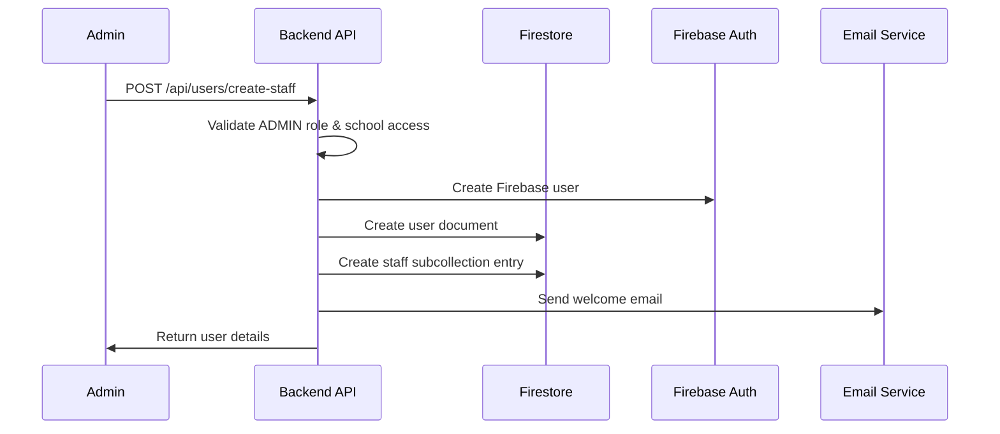
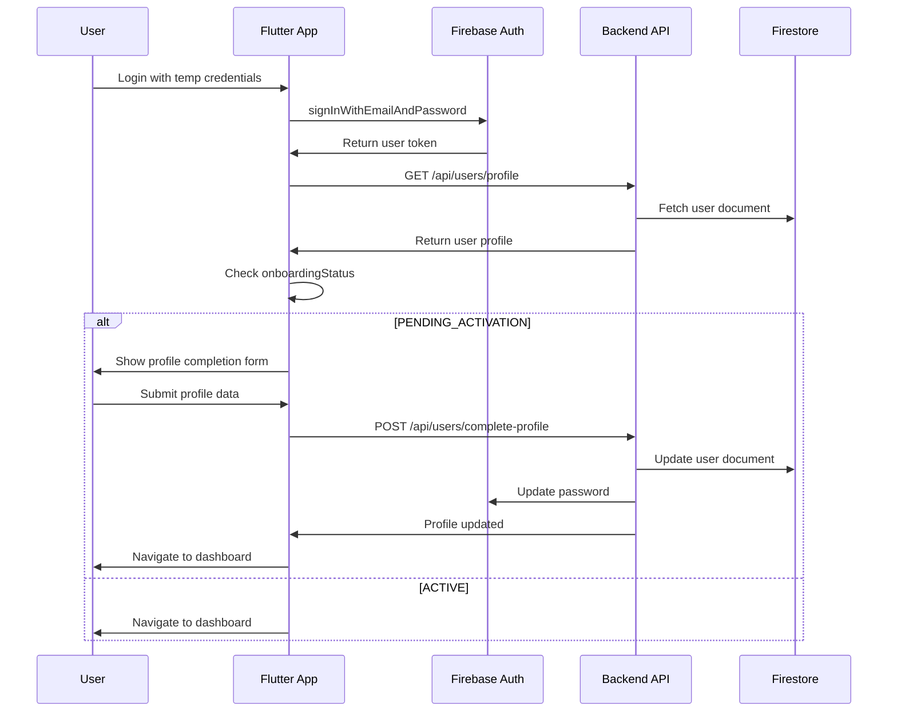

# User Onboarding Flow

## Role-Based User Creation Process

### 1. ADMIN Creates STAFF Users



### 2. User Onboarding States

```typescript
enum OnboardingStatus {
  PENDING_ACTIVATION = "PENDING_ACTIVATION",
  EMAIL_VERIFIED = "EMAIL_VERIFIED", 
  PROFILE_COMPLETED = "PROFILE_COMPLETED",
  ACTIVE = "ACTIVE"
}
```

### 3. API Endpoints

#### Create Staff User (ADMIN only)
```typescript
POST /api/users/create-staff
Authorization: Bearer <admin_token>

Request Body:
{
  "email": "teacher@greenvalley.edu",
  "displayName": "Mary Johnson",
  "staffType": "TEACHING",
  "department": "English",
  "designation": "Teacher",
  "employeeId": "EMP002",
  "joiningDate": "2021-06-01",
  "leaveEntitlements": {
    "casualLeave": 12,
    "sickLeave": 12,
    "earnedLeave": 15
  }
}

Response:
{
  "success": true,
  "userId": "staff_001",
  "temporaryPassword": "TempPass456!",
  "onboardingStatus": "PENDING_ACTIVATION"
}
```

#### Complete User Profile (First Login)
```typescript
POST /api/users/complete-profile
Authorization: Bearer <user_token>

Request Body:
{
  "phoneNumber": "+91-9876543211",
  "address": {
    "street": "123 Main St",
    "city": "Mumbai",
    "state": "Maharashtra",
    "pincode": "400001"
  },
  "emergencyContact": {
    "name": "John Johnson",
    "relationship": "Spouse",
    "phoneNumber": "+91-9876543212"
  },
  "newPassword": "NewSecurePass123!"
}
```

### 4. Onboarding Implementation

#### Step 1: Create Firebase User
```javascript
async function createStaffUser(adminUid, schoolId, staffData) {
  // Validate admin permissions
  const admin = await validateAdminAccess(adminUid, schoolId);
  
  // Create Firebase Auth user
  const tempPassword = generateSecurePassword();
  const firebaseUser = await admin.auth().createUser({
    email: staffData.email,
    password: tempPassword,
    displayName: staffData.displayName,
    emailVerified: false
  });

  return { firebaseUser, tempPassword };
}
```

#### Step 2: Create User Document
```javascript
async function createUserDocument(firebaseUser, schoolId, staffData, createdBy) {
  const userData = {
    uid: firebaseUser.uid,
    email: staffData.email,
    displayName: staffData.displayName,
    role: "STAFF",
    schoolId: schoolId, // Immutable
    staffType: staffData.staffType,
    status: "ACTIVE",
    onboardingStatus: "PENDING_ACTIVATION",
    createdAt: FieldValue.serverTimestamp(),
    updatedAt: FieldValue.serverTimestamp(),
    createdBy: createdBy,
    profile: {
      department: staffData.department,
      designation: staffData.designation,
      employeeId: staffData.employeeId,
      joiningDate: new Date(staffData.joiningDate)
    },
    permissions: {
      canApplyLeave: true,
      canRequestPermission: true,
      canViewOwnData: true
    }
  };

  await db.collection('users').doc(firebaseUser.uid).set(userData);
  return userData;
}
```

#### Step 3: Create Staff Subcollection Entry
```javascript
async function createStaffEntry(schoolId, firebaseUser, staffData) {
  const staffEntry = {
    staffId: firebaseUser.uid,
    userId: firebaseUser.uid,
    employeeId: staffData.employeeId,
    status: "ACTIVE",
    joiningDate: new Date(staffData.joiningDate),
    department: staffData.department,
    designation: staffData.designation,
    staffType: staffData.staffType,
    leaveEntitlements: staffData.leaveEntitlements,
    createdAt: FieldValue.serverTimestamp(),
    updatedAt: FieldValue.serverTimestamp()
  };

  await db.collection('schools').doc(schoolId)
    .collection('staff').doc(firebaseUser.uid).set(staffEntry);
}
```

### 5. First Login Flow



### 6. Profile Completion Implementation

```javascript
async function completeUserProfile(uid, profileData) {
  const batch = db.batch();
  
  // Update user document
  const userRef = db.collection('users').doc(uid);
  batch.update(userRef, {
    'profile.phoneNumber': profileData.phoneNumber,
    'profile.address': profileData.address,
    'profile.emergencyContact': profileData.emergencyContact,
    onboardingStatus: 'PROFILE_COMPLETED',
    updatedAt: FieldValue.serverTimestamp()
  });

  await batch.commit();

  // Update Firebase Auth password
  await admin.auth().updateUser(uid, {
    password: profileData.newPassword,
    emailVerified: true
  });

  // Send welcome email
  await sendWelcomeEmail(uid);
}
```

### 7. Validation Functions

#### Admin Access Validation
```javascript
async function validateAdminAccess(adminUid, schoolId) {
  const adminDoc = await db.collection('users').doc(adminUid).get();
  const admin = adminDoc.data();
  
  if (!admin) {
    throw new Error('Admin user not found');
  }
  
  if (admin.role !== 'ADMIN') {
    throw new Error('Insufficient permissions');
  }
  
  if (admin.schoolId !== schoolId) {
    throw new Error('School access denied');
  }
  
  if (admin.status !== 'ACTIVE') {
    throw new Error('Admin account is not active');
  }
  
  return admin;
}
```

#### Staff Data Validation
```javascript
function validateStaffData(data) {
  const required = ['email', 'displayName', 'staffType', 'department', 'designation', 'employeeId'];
  const missing = required.filter(field => !data[field]);
  
  if (missing.length > 0) {
    throw new Error(`Missing required fields: ${missing.join(', ')}`);
  }
  
  if (!['TEACHING', 'NON_TEACHING'].includes(data.staffType)) {
    throw new Error('Invalid staff type');
  }
  
  if (!isValidEmail(data.email)) {
    throw new Error('Invalid email format');
  }
  
  return true;
}
```

### 8. Email Templates

#### Welcome Email Template
```html
<!DOCTYPE html>
<html>
<head>
    <title>Welcome to {{schoolName}}</title>
</head>
<body>
    <h2>Welcome to {{schoolName}}!</h2>
    <p>Dear {{displayName}},</p>
    
    <p>Your account has been created successfully. Please use the following credentials to log in:</p>
    
    <div style="background: #f5f5f5; padding: 15px; margin: 20px 0;">
        <strong>Email:</strong> {{email}}<br>
        <strong>Temporary Password:</strong> {{temporaryPassword}}
    </div>
    
    <p><strong>Important:</strong> You will be required to change your password on first login.</p>
    
    <p>Login URL: <a href="{{loginUrl}}">{{loginUrl}}</a></p>
    
    <p>Best regards,<br>{{schoolName}} Administration</p>
</body>
</html>
```

### 9. Error Handling & Rollback

```javascript
async function createStaffUserWithRollback(adminUid, schoolId, staffData) {
  let firebaseUser = null;
  let userDocCreated = false;
  let staffDocCreated = false;
  
  try {
    // Step 1: Create Firebase user
    const result = await createStaffUser(adminUid, schoolId, staffData);
    firebaseUser = result.firebaseUser;
    
    // Step 2: Create user document
    await createUserDocument(firebaseUser, schoolId, staffData, adminUid);
    userDocCreated = true;
    
    // Step 3: Create staff entry
    await createStaffEntry(schoolId, firebaseUser, staffData);
    staffDocCreated = true;
    
    // Step 4: Send welcome email
    await sendWelcomeEmail(firebaseUser.uid, result.tempPassword);
    
    return {
      success: true,
      userId: firebaseUser.uid,
      temporaryPassword: result.tempPassword
    };
    
  } catch (error) {
    // Rollback in reverse order
    if (staffDocCreated) {
      await db.collection('schools').doc(schoolId)
        .collection('staff').doc(firebaseUser.uid).delete();
    }
    
    if (userDocCreated) {
      await db.collection('users').doc(firebaseUser.uid).delete();
    }
    
    if (firebaseUser) {
      await admin.auth().deleteUser(firebaseUser.uid);
    }
    
    throw error;
  }
}
```
